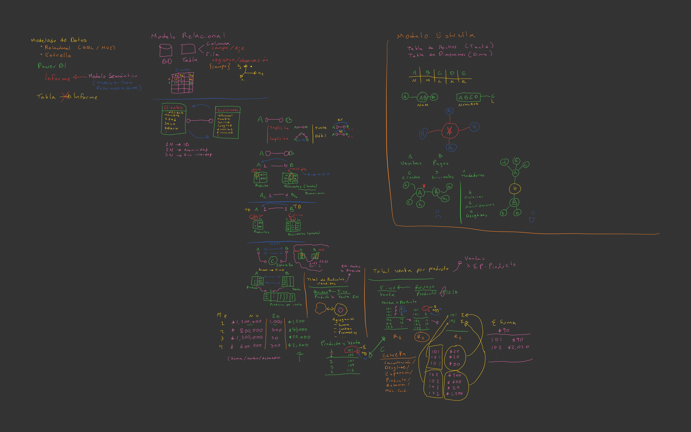
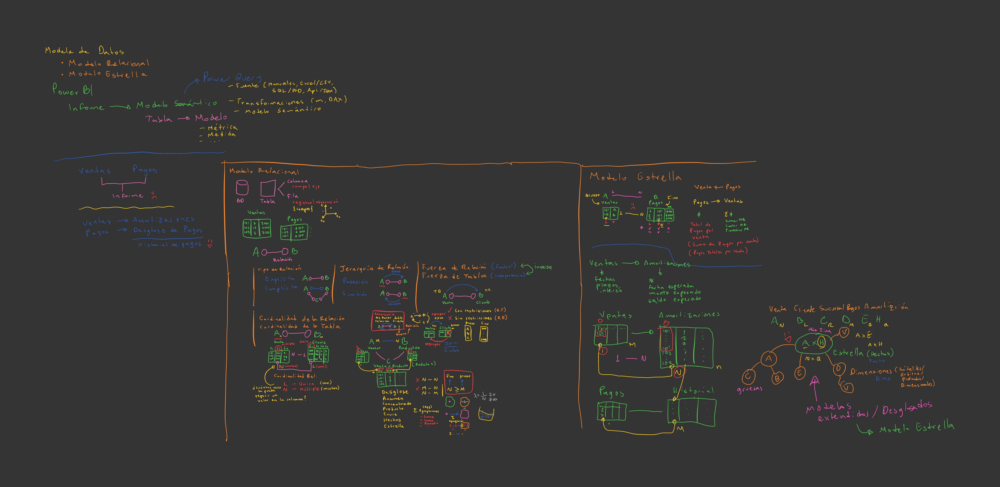

# Curso de Power BI para Scotiabank

> Alan Badillo Salas

## Sesión 103

### Módulo III - Modelado relacional y modelo estrella

1. Tablas de hechos y dimensiones.
2. Claves, cardinalidad y relaciones.
3. Tabla calendario e inteligencia de tiempo base.
4. Buenas prácticas de diseño de modelo.
5. Diagnóstico de errores de relación.

## Resumen

En esta clase se estudió la teoría sobre el modelado de datos mediante el *Modelo Relacional* y el *Modelo Estrella*.

Los elementos fundamentales del análisis de datos en modelos relacionales son las tablas, compuestos de columnas (campos o ejes de datos) y las filas (registros u observaciones), las cuales se pueden enlazar con otras tablas para formar relaciones de dominio para profundizar el análisis de los datos.

Las tablas pueden ser vistas como modelos y las columnas de la tabla/modelo podrán ser conectadas con otras columnas bajo una relación y restricción.

**Tipos de relaciones**

- *Relación explícita* - Conecta una columna del un modelo *A* con una columna de un modelo *B*
- *Relación implícita* - Existe un camino entre un modelo *A* y un modelo *B*, pasando por modelos intermedios (asociación de columnas indirectas)

Ejemplos: 

> Relación entre la columna `x` del modelo `A` y la columna `y` del modelo `B`

`A.x [1-N] B.y`

> Relación entre la columna `x` del modelo `A` y la columna `z` del modelo `C`,
> y entre la columna `w` del modelo `C` y la columna `y` del modelo `B`

`A.x [1-N] C.z | C.w [M-1] B.y`

**Nota:** Esto equivale a `A.x [N-M] B.y`

Este tipo de relaciones *"mucho a muchos"* es fundamental para encontrar la tabla producto que sea más fina (concentre la mayor cantidad de información), la cual diremos que es la tabla de mayor cardinalidad y será nuestra *Tabla de Hechos* en el *Modelo Estrella*. Las demás tablas más gruesas (de menor cardinalidad), serán tablas sátelite orbitando y las llamaremos *Tablas Dimensionales*.

**Esquema 1 de la clase**

**Esquema 2 de la clase**

## Reto del día (miércoles 6, mayo 2026)

> Reto 103

Datas las siguientes tablas

A - Ventas

Folio | Cliente
--- | ---
101 | c1
102 | c1
103 | c2

B - Clientes

ID | Nombre
--- | ---
c1 | Lore
c2 | Pedro

C - Ventas x Productos

Folio | Producto
--- | ---
101 | 1
101 | 1
101 | 3
101 | 5
101 | 2
102 | 2
102 | 2
102 | 5

D - Productos

ID | Nombre | Precio
--- | --- | ---
1 | Coca Cola 600ml | \$ 25.50
2 | Galletas Marías | \$ 18.90
3 | Gansito | \$ 22.50
4 | Chocorrol | \$ 23.90
5 | Sabritas 45g | \$ 42.10

1. Determina cuántas ventas tiene cada cliente
2. Determina cuántas ventas tiene cada producto
3. Determina cuánto se vendió en total de cada venta
4. Determina cuántos productos totales (incluso repetidos) ha comprado cada cliente
5. Determina cuántos productos distintos (sin repetir) ha comprado cada cliente
6. Determina el precio promedio de los productos que compra cada cliente

- ¿Cuáles son las cardinalidades de las tablas?
- ¿Cómo es la relación `Ventas.Folio [? - ?] Productos.ID`?
- ¿Cómo es la relación `Cliente.ID [? - ?] Productos.ID`?
