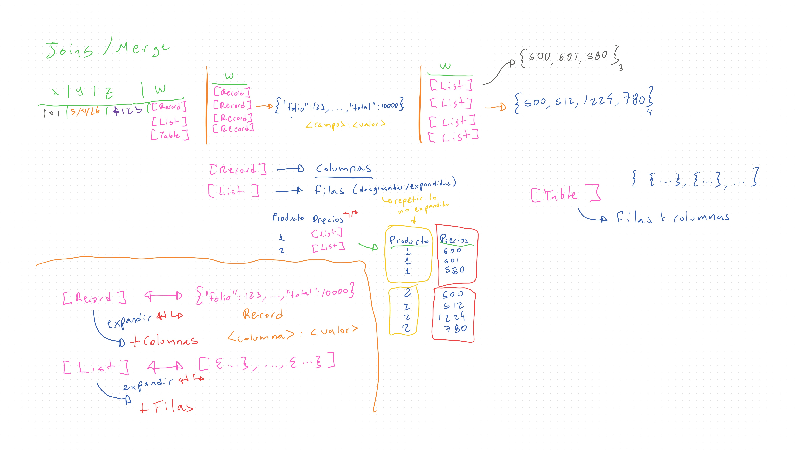

# Curso de Power BI para Scotiabank

> Alan Badillo Salas

## Sesión 104

## Resumen

En esta clase se comenzó a profundizar sobre el *Lenguaje M* y *DAX*.

Power Query utiliza el *Lenguaje M* para definir las transformaciones que va sufriendo un objeto origen hasta devolverlo. En el *script* paso a paso, solo se muestra la última operación aplicada, pero en el *script* completo, se puede ver la transformación de principio a fin, por ejemplo:

**Esquema de la clase**

## Reto del día (jueves 7, mayo 2026)

> Reto 104

1. Consulta las API o descarga los JSON de ventas y pagos del repositorio
2. Obtén la tabla cruzada entre ventas y pagos (`[Pagos por venta]`)
3. Crea una consulta en blanco que cuyo origen sea la tabla de `[Pagos por venta]`
4. Deja únicamente la fecha de pago y el monto recibido
5. Transforma la columna de fecha de pago a únicamente fecha
6. Agrupa la suma de montos recibidos por pagos

- ¿Cúales son las 10 fechas que recibieron más pagos?
- ¿Cúales son las 10 fechas que recibieron menos pagos?